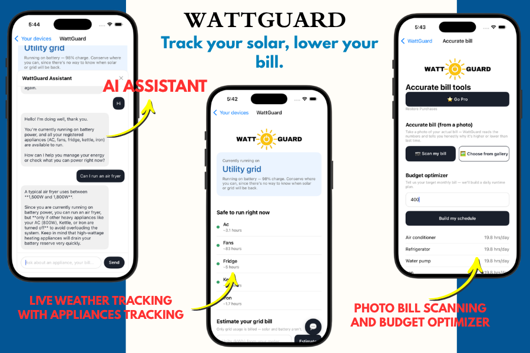

# WattGuard

An AI-powered app that manages your solar and your bill.

## The Problem

I have solar panels on my rooftop, but do they fulfill the expectations I had when I first installed them? No. Why? Because I don't know exactly what appliances I can run and for how long. I really don't know why my bill rises even when I use solar, and I don't know if I run a specific heavy appliance, what I need to power off, or whether it will run easily. This is all simple calculation.

I used to go upstairs every single day, every time, because a heavy appliance made the solar system trip off, and that frustrated me a lot. And whenever the bill arrived, we all used to blame each other — why? Because we lack management over appliances. We lack control.

And honestly speaking, this isn't just my problem. Around 25 million households worldwide already rely on rooftop solar, and that number is projected to surge past 100 million by 2030. At the same time, off-grid solar is expected to bring first-time electricity access to almost 400 million people globally by the same year. Solar is quickly becoming the world's primary answer to energy access — but adoption means nothing without management. A solar system nobody understands how to use is just as frustrating as having no power at all.

**So, in order to solve this huge and frustrating problem, I created WattGuard — an app that does simple calculations and tells you, in plain language, what you can run, why your bill rises, and even schedules a plan for you according to your targeted monthly bill.**

## What It Does

WattGuard tracks your solar system in real time. Using Open-Meteo, it checks how much energy your solar panels are producing right now, then runs the calculations to tell you exactly what you can safely do with that power.

The app is simple by design. You register, enter basic information about your solar panels and battery, then add your temporary and permanent appliances. After a short setup, you land on your dashboard — showing the appliances you can run all together, with their time limit, and below that, the appliances you could still run if you switch off one or two from the list above.

If there's a new appliance you want to check, or any confusion, we built the **WattGuard Assistant**. Ask it whatever you want, and it will answer exactly according to your live data.

## Features

Knowing what you can run solves half the problem. The other half is the bill.

**Bill Estimation** — Before the bill arrived, we literally used to become our own Einstein, calculating the bill in our heads based on how much AC we ran, scaring each other with jokes about how the house was about to turn into hell once the bill came. WattGuard ends that guessing game. Enter your kilowatt-hours used, and the AI tells you your expected bill for the month before it even arrives — calculated according to your country's per-unit pricing — so the number stops being a surprise and starts being something you can actually plan around.

**Photo Bill Scanning** (Pro) — This one is personal. Before WattGuard, my mother used to look at the bill and say, "There's definitely an error, the bill can't be this high, we don't use that much electricity." To solve that, I built a bill scanner that reads your bill photo and tells you exactly why it went up — using the history it has of you running on solar, battery, or grid, comparing it, and explaining the cause in plain language.

**Budget Optimizer** (Pro) — This feature comes from a hard time in our own household, when we didn't have enough budget to run the house, and it was even difficult to pay my fees. The only thought I had back then was: if we built a routine, we could save a lot of money. So the Budget Optimizer gives you a proper daily schedule of which appliances to run, based on the target monthly bill you set.

## How the AI Logic Actually Works

WattGuard never guesses about your battery. The flow is:

1. **Weather** (`backend/api/weather.py`) — pulls live conditions (day/night, sky condition, cloud cover, rain chance) from Open-Meteo, a free API that needs no key.
2. **Power routing** (`backend/api/power_router.py`) — decides Solar / Grid / Battery. Battery is only ever chosen when the user has explicitly marked it as charging/in use in the app — the AI has no way to sense that on its own, so it never assumes it.
3. **Appliances** (`backend/api/appliances.py`) — turns the current power source into a plain answer per appliance: safe to run or not, and for how long, in whichever unit (hours/minutes/seconds) actually makes sense.
4. **Billing** (`backend/api/bill.py`) — only the grid is billed. Includes the Pro bill-translator and budget-optimizer endpoints.

## Monetization — Powered by RevenueCat

WattGuard uses **RevenueCat** to handle the entire Free vs. Pro experience — subscriptions, entitlement checks, and purchase flow — without building any of that infrastructure from scratch.

**How it works:**

- Every user's Pro access is controlled by a single RevenueCat entitlement: `watt guard Pro`.
- On login or signup, the app identifies the user to RevenueCat using their WattGuard account ID (`Purchases.logIn()`), so Pro status is tied to the *account*, not the device — log in on a new phone, and your Pro access follows you.
- Pro features (Photo Bill Scanning, Budget Optimizer) are gated behind a live `isPro` check, powered by a custom `useIsPro()` hook that listens for real-time entitlement changes — the moment a purchase completes, the UI updates instantly, with no reload or manual refresh needed.
- Free users see a **"⭐ Go Pro"** button. Tapping it opens RevenueCat's built-in paywall UI (`RevenueCatUI.presentPaywallIfNeeded`), which handles the entire purchase flow — plan selection, payment, and confirmation — without any custom paywall screen needed on our end.
- A **Restore Purchases** option is included, as required by App Store guidelines, so returning users never lose access they already paid for.

**Why this matters for WattGuard specifically:** the free tier already solves the core problem (knowing what's safe to run, right now, for free). Pro is reserved for the deeper tools — bill scanning and budget planning — the features that require more backend AI work to deliver, and that turn WattGuard from a helpful checker into a real financial planning tool for your electricity bill.

## Tech Stack

| Layer | Technology |
|---|---|
| Mobile App | Expo / React Native |
| Backend API | Python (Flask) |
| Weather Data | Open-Meteo API (free, no key required) |
| AI Assistant | LLM-powered chatbot (live data-aware) |
| Monetization | RevenueCat (subscriptions, entitlements, paywall) |
| Photo Bill Scanning | Image capture + OCR/vision extraction |
| Local Dev Database | SQLite |
| Navigation | React Navigation |
| Image Handling | expo-image-picker |

## Project Layout

```
backend/            Flask API (this is what your phone talks to)
  app.py              entry point — run this
  api/
    weather.py         live weather lookup
    power_router.py     solar/grid/battery decision + alert logic
    appliances.py       safe-to-run + runtime per appliance
    bill.py              grid bill estimate + pro bill tools
  models/
    appliances.py        appliance catalog (wattages)

mobile/              Expo / React Native app
  App.js               navigation between the 4 screens
  screens/
    AuthScreen.js         Screen 1 — login/signup
    SetupScreen.js         Screen 2 — solar panels, battery
    DashboardScreen.js      Screen 3 — the main energy hub
    AccurateBillScreen.js    Screen 4 — Pro tools, paywall
  components/           shared UI pieces
  services/
    api.js               talks to the Flask backend
    purchases.js           RevenueCat wrapper (pro entitlement)
```

## Running the Backend

```
cd backend
pip3 install -r requirements.txt
python3 app.py
```
Runs on `http://localhost:5000`. Check it's alive: `curl http://localhost:5000/api/health`

## Running the Mobile App

```
cd mobile
npm install
npx expo start --dev-client
```
Scan the QR code with your dev-client build, or press `i`/`a` to open the iOS Simulator / Android emulator. **Before that works**, open `mobile/services/api.js` and change `BASE_URL` from `localhost` to your Mac's LAN IP (find it with `ipconfig getifaddr en0`) — a phone can't reach your laptop's `localhost`.

## Screenshots



## Demo Video

https://youtu.be/r322avnMl6w

## Terminology Note

Everything in the UI uses US utility language for the judges: "utility grid" (not WAPDA), "electricity bill / kWh" (not units), "zip code" (not area/region). The underlying logic is unchanged.

## License

See [LICENSE](LICENSE).
